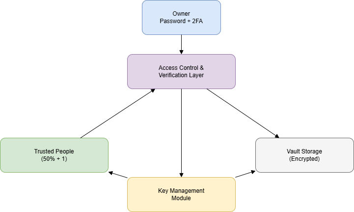

# Secure Digital Document Vault
In this project, we'll design and implement a secure system for protecting, sharing, and verifying digital documents using modern applied cryptographic techniques.

## 1. System Overview
### Problem that we solve with this project
When a person dies without sharing access credentials to financial accounts, legal documents, or digital records, their relatives may face serious difficulties accessing essential information. At the same time, sharing full access in advance creates significant security risks during the owner’s lifetime.

This system provides a structured and secure mechanism to:
* Store sensitive documents confidentially
* Distribute future access authority among multiple trusted individuals
* Enforce a majority-based access policy (50% + 1)
* Prevent unilateral access by a single trusted person
* Protect stored data even if the storage location is compromised

The owner has it's own password and two factor autentication to add, remove, or alter the documents or list of trusted people. Any trusted people must create a paswword and define a two factor authentication.

For example, the owner can designate 5 trusted people, as the required number of trusted people approval is set at 50% + 1. For the exmple, 3 persons. During the lifetime of the owner, he can add or remove people to the trusted list. When one person is removed, all the tokens are changed to ensure the old token won't work.
### Features
* Ensure documents remain confidential during the owner’s lifetime
* Protect stored data even if the storage location is compromised
* Controlled access after death
* Define and modify the list of trusted people
* Protect against unilateral misuse by a single trusted person
* Ensure integrity verification of stored data
* Enforce majority-based reconstruction policy
### Out of scope
Although we aim to solve the after-death preservation of documents, there are some scenarios that we can't control:
* Automatic death verification mechanisms
* More than the number of trusted people decided to act in bad faith
* Side-channel attacks
* Biometric authentication
* The minimum of trusted people is dead, lost access to the system, or refuses to give their token (legal procedures must be followed)

## 2. Architecture Diagram

## Architecture Description
For the architecture, we have defined the following main components:
### 1. Owner
The central entity around which the system operates. The Owner is responsible for managing the vault and defining access policies.
* Authentication: password + two-factor authentication (2FA)
* Manages documents and trusted people
* Generates and digitally signs the Vault
* Controls the Master Key
### 2. Trusted People
Individuals designated by the Owner to be trusted with future access to the vault.
* Individual authentication: password + two-factor authentication (2FA)
* Each possesses a private key
* Receives an encrypted share of the secret
* Must collaborate to reach the required 50% + 1 threshold
### 3. Key Management Module
This component is responsible for handling cryptographic keys for both the Owner and the Trusted People.
* Generation of a unique symmetric key per file
* Hybrid encryption for key protection
* Secret fragmentation using a threshold scheme
* Key rotation when the list of trusted people changes
### 4. Vault Storage
This component stores the sensitive data uploaded by the Owner. The Vault Storage may be compromised without revealing any sensitive information. Content includes:
* Encrypted documents
* Integrity hashes
* Digital signatures
* Encrypted metadata
### 5. Access Control and Verification Layer
This layer enforces security policies and validates cryptographic guarantees.
* Verifies authentication and access permissions
* Validates digital signatures
* Verifies integrity hashes before decryption
* Reconstructs the secret only if the required majority is reached
### System Workflow
Based on these components, the general system workflow is defined as follows:
1. The Owner uploads a document.
2. A unique symmetric key is generated.
3. The document is encrypted.
4. The file key is protected using hybrid encryption.
5. The Master Key is split among the Trusted People.
6. All data is stored encrypted in the Vault.
7. After the Owner’s death, Trusted People provide their tokens.
8. If the 50% + 1 threshold is reached, the Master Key is reconstructed.
9. Signature and integrity verification are performed.
10. The vault content is decrypted.
### Image at:

## 3. Security Requirements
### Confidentiality of file contents
An attacker who obtains the encrypted vault container must not be able to learn the contents of stored documents without access to the master secret or the required majority of trusted individuals.
### Integrity of file contents
The system must generate and store a cryptographic hash for every file upon upload and validate this hash against the file contents upon every retrieval to ensure data has not been altered.
### Authenticity of file sender
Trusted individuals must be able to verify that the vault was created by the legitimate owner and not by an attacker. If the vault is replaced or forged, the system must detect the lack of authenticity.
### Confidentiality of private keys
The system must encrypt all private keys in use or not in use, ensuring they are accessible only to the authenticated key owner and are never stored, logged, or exposed in plaintext.
### Protection against tampering
Any unauthorized modification of encrypted documents must be detectable before revealing decrypted content. The system must not output altered plaintext without detecting tampering.

## 4. Threat Model
### Assets
* Files: all the plain text files stored
* Master key: the key that is used to add, remove, and alter the files
* Private keys: all the keys (owner and trusted people)
### Adversaries
We define the following types of adversaries:
* External: any not trusted person who tries to access the information
    * Attackers know the system design
    * Can read all the encrypted documents
    * Can modify documents
    * Doesn't know the owner key or any trusted person key
    * Can't break the encryption algorithm
    * Can't recreate the master key
* Malicious trusted person: any person or group of trusted persons that doesn't reach the required tockens that tries to access the information. 
    * Can read all the encrypted documents
    * Can modify documents
    * Doesn't know the owner key
    * Can't break the encryption algorithm
    * Can't recreate the master key
## 5. Trust Assumptions
To ensure the correct functionality,y we assume that the following is achieved:
* Users choose sufficiently strong passwords
* Secure randomness is available
* Cryptographic primitives behave as expected
* Fewer than 50% + 1 trustees collude maliciously
* Devices are not fully compromised during setup
## 6. Attack Surface Review
* File Input
   * What could go wrong: An attacker with temporary access could upload a fraudulent version or corrupted assets before the vault is sealed. Additionally, uploading malware could target the beneficiary upon retrieval.
   * Security Property at Risk: Integrity & Availability.
* Metadata Parsing
   * What could go wrong: Malformed metadata in uploaded legal documents could exploit the system to reveal the identity of the beneficiaries or the conditions of the vault's release to an unauthorized person.
   * Security Property at Risk: Confidentiality.
* Key Import/Export
   * What could go wrong: If the system uses multiple keys for trustees, an attacker could intercept the key shares during export, or a beneficiary might import a compromised private key, allowing a third party to steal the inheritance immediately upon release.
   * Security Property at Risk: Confidentiality.
* Password Entry
   * What could go wrong: Attackers could guess weak passwords like "12345", try many combinations quickly with brute-force, or use software to record the keystrokes when the password is typed.
   * Security Property at Risk: Availability & Confidentiality.
* Sharing Workflow
   * What could go wrong: Vulnerabilities in the logic that designates could allow an attacker to inject themselves as a beneficiary or escalate their privileges from Trustee to Owner.
   * Security Property at Risk: Access Control & Confidentiality.
* Signature Verification
   * What could go wrong: If the system fails to correctly verify the digital signature of the deceased on the stored documents, a malicious heir could alter instructions after the owner's death without detection.
   * Security Property at Risk: Non-Repudiation & Integrity.
* CLI arguments
   * What could go wrong: If the "Death Verification" commands are executed via CLI by administrators, sensitive parameters could be logged in history files, exposing the final keys.
   * Security Property at Risk: Confidentiality.
## 7. Design Constraints Derived from Requirements

| Requirement | Design Constraint |
|------------|-------------------|
| Confidentiality of file contents | Must use AEAD encryption with unique symmetric keys per file |
| Integrity of file contents | Must use authenticated encryption and cryptographic hashing for verification |
| Authenticity of file sender | Must implement digital signatures to verify vault owner identity |
| Confidentiality of private keys | Must encrypt private keys using password-based key derivation (KDF) |
| Prevent unilateral access by single trustee | Must implement secret sharing scheme requiring majority threshold (k-of-n) |

## Core Functionalities

- Generate a unique symmetric key for each file.
- Protect file keys using recipients’ public keys (hybrid encryption).
- Digitally sign documents to guarantee authenticity.
- Verify signatures before decrypting any content.
- Protect private keys using a password-based key derivation function (KDF).
- Allow secure sharing with multiple recipients.
- Provide a basic key backup and recovery mechanism.

## Members:
 - Domínguez Chávez Jesús Abner **(Chief Testing)**
 - Hernandez Ruiz de Esparza Guillermo **(Chief Documentation)**
 - Sanchez Villlalpando Johan **(Chief Coding)**
 - Quintana Mora Luis Angel **(Chief Architecture)**
